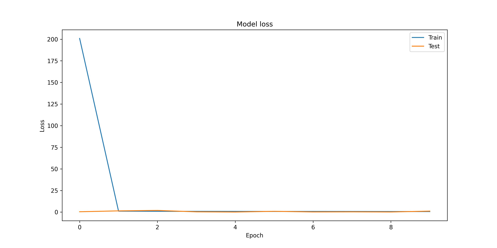

# Projectile Motion Network 

This document presents a graphical analysis of a neural network trained to predict the range of projectile motion based on initial velocity and launch angle.

## 1. Model Architecture
The neural network consists of:
- Input layer: 2 neurons (velocity and angle)
- 3 hidden layers: 64 neurons each with ReLU activation
- Output layer: 1 neuron (range prediction) with linear activation

## 2. Training Performance
The model was trained for 10 epochs with Adam optimizer and MSE loss function.

Figure 1: Training and validation loss across epochs showing convergence.

