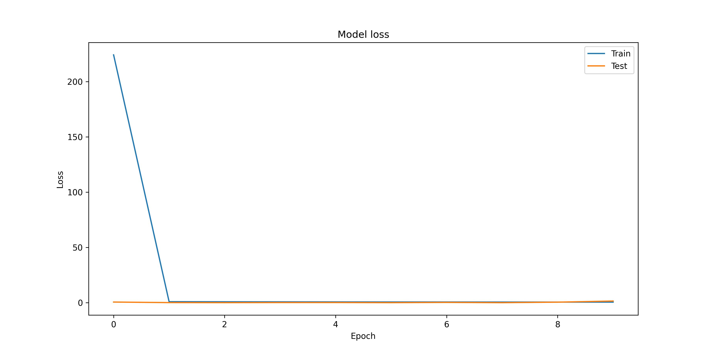
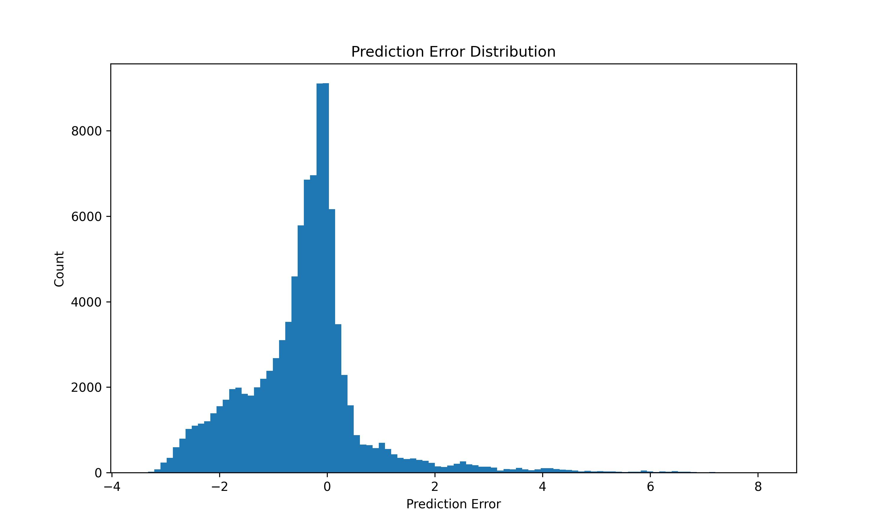

# Projectile Motion Network 

This document presents a graphical analysis of a neural network trained to predict the range of projectile motion based on initial velocity and launch angle.

## 1. Model Architecture
The neural network consists of:
- Input layer: 2 neurons (velocity and angle)
- 3 hidden layers: 64 neurons each with ReLU activation
- Output layer: 1 neuron (range prediction) with linear activation

## 2. Training Performance
The model was trained for 10 epochs with Adam optimizer and MSE loss function.

*Figure 1: Training and validation loss across epochs showing convergence.*

## 3. Prediction Accuracy
Comparison between actual and predicted range values on test data:

*Figure 2: Scatter plot showing strong correlation between predicted and actual range values (R² = [empty for now]).*

## 4. Error Analysis
Distribution of prediction errors:

*Figure 3: Histogram of prediction errors showing mean error of {mean_error}m and standard deviation of [empty for now].*

## 5. 3D Surface Visualization
Comparison between neural network predictions and theoretical physics:

*Figure 4: (Left) NN predictions, (Middle) Theoretical physics, (Right) Prediction errors. The neural network closely approximates the theoretical model.*

## 6. Contour Analysis
Detailed view of range predictions across parameter space:

*Figure 5: Contour plots showing (Left) NN predictions, (Middle) Theoretical values, (Right) Error magnitudes.*

## 7. Slice Analysis
Range vs Velocity at 45°
